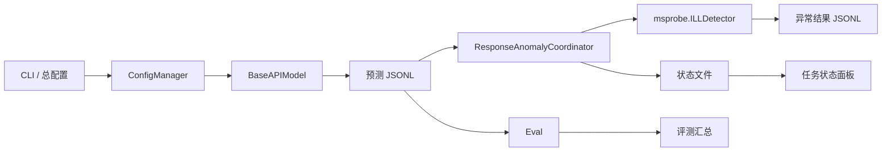
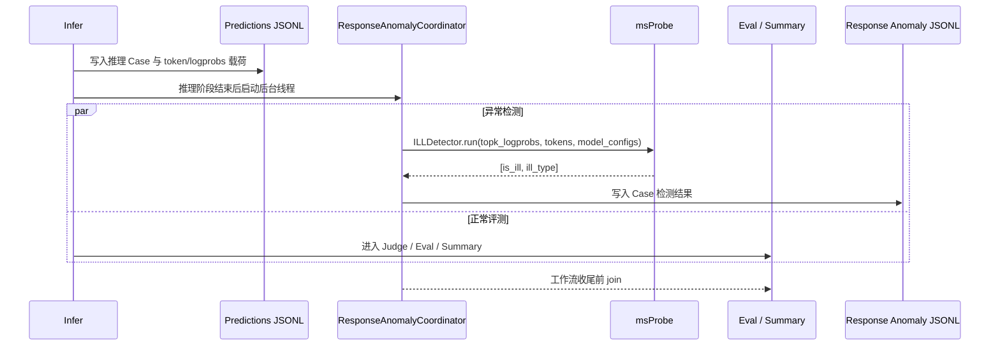

# AISBench 推理响应异常检测模块设计

## 1. 概述

### 1.1 背景

大模型推理服务可能出现生僻字、乱码、重复输出以及 logprob 为 `NaN` 或 `Inf` 等输出异常。AISBench 在完成服务模型推理后，基于推理响应中的 token id 与 top-k logprobs 调用 msProbe 的 Response Anomaly 能力，对每个 Case 进行异常检测。

本模块不实现或改写检测算法；异常判定统一由已安装的官方 `mindstudio-probe` 包提供的 `msprobe.response_anomaly.detector.ILLDetector` 完成。

### 1.2 目标

1. 通过总配置与命令行开关启用或关闭响应异常检测。
2. 推理完成后以后台线程执行检测，并与后续 Eval、汇总阶段并行。
3. 输出 Case 级异常状态、异常类型与检测执行状态。
4. 将检测明细落盘，并在任务状态面板显示检测进度及类型统计。
5. 在 `--reuse` 中断续推场景继承已有异常检测结果和统计数量。
6. 将 msProbe 作为可选依赖；未安装时不影响普通 AISBench 推理与评测。

### 1.3 非目标

- 不在 AISBench 内部复制、修改或维护 msProbe 的异常检测算法。
- 不在 AISBench 内部复制或维护 token 分类生成算法；AISBench 仅提供包装工具调用 msProbe 官方生成器，并将产物输出到用户指定目录。
- 不将异常 Case 自动改写为推理失败，也不改变原有评测指标；异常信息是独立审计结果。
- 当前仅覆盖通过 `BaseAPIModel` 的服务模型生成链路。
- 不支持性能模式（`perf`）与 Agent 测评链路（SWE-bench / SWE-bench Pro / BFCL / agent_example 等）；在这些场景启用会直接报错，避免静默空转或改变 Agent 请求参数。

## 2. 依赖与前置条件

### 2.1 软件依赖

响应异常检测通过可选 extra 引入官方包：

```bash
pip install 'ais-bench-benchmark[response_anomaly]'
```

依赖定义位于 [requirements/response_anomaly.txt](../../../requirements/response_anomaly.txt)。安装 `response_anomaly` extra 时，pip 会从 GitCode 下载并构建固定提交 `3de412d71d6566a62c28b9131f9969930628d87f` 的官方 msProbe 源码。AISBench 正常安装不强制安装该依赖；安装环境需要 Git 与 GitCode 网络访问。

### 2.2 服务响应要求

服务端必须在响应中返回：

- 生成 token 序列：`token_ids` 或 `tokens`
- 每个生成 token 对应的 top-k logprobs：`topk_logprobs`

AISBench 启用功能时会向服务请求参数补充：

```python
logprobs=True
top_logprobs=20
```

服务适配器将上述字段提取为 `response_anomaly_payload`。单条响应完成后，输出处理器通过本地 Unix Domain Socket 将其提交给对应模型的检测进程，提交成功即解除引用，不写入预测文件或临时文件。服务未提供必要字段时，Case 仍正常评测，但检测结果记录为 `skipped`。

### 2.3 msProbe 模型配置要求

msProbe 检测依赖三个文件：

| 文件 | 作用 |
| --- | --- |
| `config.yaml` | 检测算法阈值配置。 |
| `mtype_config.json` | 模型名与 BOS/EOS token id 映射，用于交叉验证模型。 |
| `token2category/<模型名>_<词表大小>.json` | token id 到字符类别映射，用于生僻字和乱码检测。 |

三个文件均可通过 AISBench 配置指定路径；未指定时回退到 msProbe 安装包内默认文件。对于 msProbe 未内置的模型，可使用 AISBench 提供的包装工具调用 msProbe 官方 `gen_model_config.py` 生成：

```bash
ais_bench-gen-response-anomaly-config \
  --model-path /home/Qwen3-30B-A3B \
  --model-name Qwen3-30B-A3B \
  --output-dir ./msprobe_configs
```

产物布局：

```text
./msprobe_configs/
├── configs/
│   ├── config.yaml
│   └── mtype_config.json
└── token2category/
    └── qwen3-30b-a3b_151643.json
```

`mtype_config.json` 支持多模型合并，多次运行不会互相覆盖；`config.yaml` 已存在时不会被覆盖，便于用户手工调阈值。

## 3. 总体设计

### 3.1 模块关系



### 3.2 执行时序



### 3.3 关键模块

| 模块 | 文件 | 职责 |
| --- | --- | --- |
| CLI 开关 | [ais_bench/benchmark/cli/argument_parser.py](../../../ais_bench/benchmark/cli/argument_parser.py) | 提供 `--response-anomaly` 和 `--no-response-anomaly`。 |
| 配置归一化 | [ais_bench/benchmark/cli/config_manager.py](../../../ais_bench/benchmark/cli/config_manager.py) | 合并 CLI / 总配置，注入服务端 logprobs 请求参数。 |
| 工作流协调 | [ais_bench/benchmark/cli/workers.py](../../../ais_bench/benchmark/cli/workers.py) | 推理前启动检测进程；推理结束后 drain 队列，工作流结束前等待检测完成。 |
| 响应采集 | [ais_bench/benchmark/models/api_models/base_api.py](../../../ais_bench/benchmark/models/api_models/base_api.py) | 从流式或非流式服务响应中提取 token 与 top-k logprobs。 |
| Case 透传 | [ais_bench/benchmark/openicl/icl_inferencer/output_handler/gen_inferencer_output_handler.py](../../../ais_bench/benchmark/openicl/icl_inferencer/output_handler/gen_inferencer_output_handler.py) | 提取并在线提交 `response_anomaly_payload`，提交后立即释放。 |
| 检测协调器 | [ais_bench/benchmark/utils/response_anomaly.py](../../../ais_bench/benchmark/utils/response_anomaly.py) | 读预测、合并模型级配置、按需生成 msProbe 配置、初始化检测器、落盘、恢复与状态上报。 |
| 配置生成工具 | [ais_bench/tools/response_anomaly/gen_model_config.py](../../../ais_bench/tools/response_anomaly/gen_model_config.py) | 包装 msProbe 官方生成器，输出到用户目录并合并 mtype 配置。 |
| 面板展示 | [ais_bench/benchmark/runners/base.py](../../../ais_bench/benchmark/runners/base.py) | 动态读取 `ResponseAnomaly` 状态并展示。 |

## 4. 配置设计

### 4.1 总配置与模型级配置

运行级开关与公共参数放在全局 `response_anomaly`，模型相关配置放在各模型的 `response_anomaly` 中：

```python
response_anomaly = dict(
    enabled=True,
    top_logprobs=20,
    detection_mode='online',
    detector_queue_size=16,
    detector_enqueue_timeout=30,
    msprobe_config_path='/path/to/config.yaml',  # 可选，算法阈值配置
    normal_sample_rate=0.001,
    normal_sample_min=10,
    normal_sample_max=50,
    normal_sample_seed=0,
)

models = [
    dict(
        abbr='qwen3-30b',
        attr='service',
        response_anomaly=dict(
            model_name='Qwen3-30B-A3B',
            model_path='/home/Qwen3-30B-A3B',          # 本地模型目录，用于自动生成配置
            msprobe_mtype_path='/path/to/mtype_config.json',
            msprobe_token2category_dir='/path/to/token2category/',
        ),
    ),
]
```

| 配置项 | 层级 | 类型 | 默认值 | 说明 |
| --- | --- | --- | --- | --- |
| `enabled` | 全局 | bool | `False` | 是否启动异常检测。 |
| `top_logprobs` | 全局/模型 | int | `20` | 请求服务返回的每个 token 的 top-k logprobs 数量，模型级可覆盖。 |
| `detection_mode` | 全局 | str | `online` | `online` 在推理期间检测；`post_inference` 保留推理后检测兼容模式。 |
| `detector_queue_size` | 全局 | int | `16` | 每个模型检测进程的有界队列容量。 |
| `detector_enqueue_timeout` | 全局 | float | `30` | payload 等待进入检测队列的超时时间（秒）。 |
| `model_name` | 模型 | str | 模型 `abbr` | msProbe 模型名称，应与其 `mtype_config.json` 及 token 分类映射一致。 |
| `model_path` | 模型 | str | 无 | 本地模型目录；配置后且未指定 mtype/token2category 时自动生成。 |
| `msprobe_config_path` | 全局/模型 | str | msProbe 包内默认 | 算法阈值 `config.yaml` 路径。 |
| `msprobe_mtype_path` | 模型 | str | msProbe 包内默认 | `mtype_config.json` 路径。 |
| `msprobe_token2category_dir` | 模型 | str | msProbe 包内默认 | `token2category/` 目录路径。 |
| `normal_sample_rate` | 全局 | float | `0.001` | 正常样本完整 payload 的抽样比例。 |
| `normal_sample_min` | 全局 | int | `10` | 每个模型/数据集至少保留的正常样本数；正常样本不足时全部保留。 |
| `normal_sample_max` | 全局 | int | `50` | 每个模型/数据集最多保留的正常样本数。 |
| `normal_sample_seed` | 全局 | int | `0` | 稳定哈希抽样种子。 |

当 `model_path` 已配置且未提供 `msprobe_mtype_path` / `msprobe_token2category_dir` 时，AISBench 在检测启动前自动调用配置生成工具，输出到 `<work_dir>/response_anomaly_config/<模型 abbr>/`。

### 4.2 命令行优先级

- `--response-anomaly`：强制启用。
- `--no-response-anomaly`：强制关闭。
- 未传命令行参数：采用 `response_anomaly.enabled`。

命令行优先级高于总配置。

## 5. 数据与接口设计

### 5.1 msProbe 调用接口

```python
from msprobe.response_anomaly.detector import ILLDetector

detector = ILLDetector(
    config_path,
    mtype_path,
    tk2cat_path,
)
result = detector.run([topk_logprobs], [tokens], [model_name])
```

AISBench 直接使用 `ILLDetector`，以便传入用户配置的三个文件路径；每个模型组只初始化一次检测器，避免逐 Case 重复加载配置。输入、输出与 msProbe 保持一致：

| 参数 | 类型 | 说明 |
| --- | --- | --- |
| `topk_logprobs` | `List[List[Dict[int, float]]]` | 每个请求中每个 token 的候选 token id 与 logprob。 |
| `tokens` | `List[List[int]]` | 每个请求的生成 token id 序列。 |
| `model_configs` | `List[Any]` | 每个请求对应的模型名称或 msProbe 支持的模型配置。 |
| 返回值 | `List[List[Any]]` | 格式为 `[[is_ill, ill_type], ...]`。 |

异常类型约定：`0` 正常、`1` 生僻字、`2` 乱码、`3` 重复、`4` NaN Value。

### 5.2 预测 Case 扩展字段

在线模式下，完整 token/logprob 数据只通过内存 IPC 队列进入检测进程，不写入 prediction、普通推理缓存或全量 staging。原始预测 JSONL 最终仅增加轻量检测摘要：

```json
{
  "id": 12,
  "uuid": "...",
  "prediction": "...",
  "response_anomaly": {
    "detection_status": "completed",
    "is_anomaly": true,
    "anomaly_type": 2,
    "anomaly_type_name": "garbled",
    "detector_version": "x.y.z",
    "detector_config_digest": "sha256:...",
    "token_count": 512
  }
}
```

Eval 不读取该字段，因此不改变原有指标计算。

### 5.3 异常结果 Schema

异常检测结果写入：

```text
<work_dir>/response_anomaly/<model_abbr>/<dataset_abbr>.jsonl
```

每行对应一个 Case：

```json
{
  "id": 12,
  "uuid": "...",
  "is_anomaly": true,
  "anomaly_type": 3,
  "anomaly_type_name": "repetition",
  "detection_status": "completed"
}
```

`detection_status` 的取值：

| 状态 | 含义 |
| --- | --- |
| `completed` | 已调用 msProbe 并得到检测结果。 |
| `skipped` | 推理响应未携带 token 或 top-k logprobs。 |
| `unavailable` | 未安装 `mindstudio-probe`。 |
| `failed` | 调用或输入转换发生异常，`reason` 保存错误摘要。 |

完整诊断数据按模型和数据集压缩保存：

```text
<work_dir>/response_anomaly/<model_abbr>/<dataset_abbr>_abnormal_and_failed.jsonl.gz
<work_dir>/response_anomaly/<model_abbr>/<dataset_abbr>_normal_samples.jsonl.gz
<work_dir>/response_anomaly/detector_manifest.json
```

异常和检测失败样本全部保存。正常样本采用稳定哈希抽样，数量为
`min(正常样本数, 50, max(10, ceil(正常样本数 * 0.1%)))`。manifest 保存检测器版本、配置路径及内容摘要和抽样参数。

## 6. 并发、状态与恢复设计

### 6.1 并发策略

检测进程由 `ResponseAnomalyCoordinator` 管理：

1. Infer runner 启动前，每个 service 模型启动一个检测进程并完成 msProbe 初始化。
2. 单条响应完成后通过 Unix Domain Socket 进入有界队列，检测结果独立写盘。
3. Infer 结束后停止接收新 Case 并排空队列；Eval、JudgeInfer、AccViz 可继续并行执行。
4. `ResponseAnomalyWait` 位于相关工作流尾部，等待检测进程并合并轻量摘要。

推理计时在 payload 投递前结束。队列未满时只增加 IPC 提交开销；队列满时产生有界背压，避免内存无限增长。正常非候选 payload 检测后立即释放，检测异常和投递失败 payload 才落盘。

### 6.2 状态面板

协调器将状态写入：

```text
<work_dir>/status_tmp/tmp_ResponseAnomaly.json
```

状态字段包括：

- `finish_count`：已处理 Case 数量。
- `total_count`：预测文件中的 Case 总数。
- `progress_description`：检测中或检测完成。
- `other_kwargs`：按 `anomaly_type_name` 聚合的数量。

任务面板新增 `ResponseAnomaly` 行，并在状态文件出现后动态展示。该辅助状态不参与推理任务的调度，但 runner 面板会等待其结束后再退出，保证实时刷新到检测完成。

为使状态展示可靠，`ResponseAnomaly` 状态文件使用原子替换写入，普通 runner 清理临时目录时会保留该文件；在 `infer` / `infer_judge` 等没有后续评测面板的模式中，`ResponseAnomalyWait` 会启动一个独立监控进程展示检测进度，并等待检测完成后统一清理状态目录。runner 面板会等待该辅助状态结束后再退出，保证实时刷新到检测完成。

### 6.3 中断续推

检测进程启动时读取已存在的异常结果 JSONL：

1. 以 `id + uuid` 建立已处理 Case 集合。
2. 已存在的结果不重复调用 msProbe。
3. 将既有结果的异常类型累加到实时统计。

在线模式不保存正常非抽样 payload。进程被强制终止时，尚未检测的内存 payload 无法恢复，最终标记为 `interrupted`；若需要重新检测，必须重新推理对应 Case。
4. 仅处理预测 JSONL 中未记录的 Case。

因此，结合 `--reuse` 继续执行时，已完成 Case 的异常数量和检测结果均被继承。

## 7. 异常处理

| 场景 | 行为 |
| --- | --- |
| 未安装 msProbe | Case 结果写为 `unavailable`，普通推理与 Eval 不失败。 |
| 没有 token/logprobs | Case 结果写为 `skipped`。 |
| msProbe 抛出异常 | Case 结果写为 `failed`，保留异常类型与消息到 `reason`。 |
| 单个 Case 检测失败 | 继续处理后续 Case。 |
| 结果文件已存在 | 通过文件锁追加写入，避免并发写入冲突。 |
| 推理结果文件不存在 | 该模型/数据集组合按空输入处理，不产生 Case 检测结果。 |

## 8. 测试设计

### 8.1 单元测试

[tests/UT/utils/test_response_anomaly.py](../../../tests/UT/utils/test_response_anomaly.py) 覆盖：

- `msprobe.response_anomaly.detector.ILLDetector` 的初始化与调用参数，以及自定义三个配置文件路径的传递。
- 官方接口返回的异常标志及类型向 Case 结果的映射。
- 缺少 `response_anomaly_payload` 时的 `skipped` 分支。

### 8.2 集成测试

集成环境应满足：

1. 安装 `ais-bench-benchmark[response_anomaly]`。
2. 准备 msProbe 支持的模型名称及 token 分类文件。
3. 使用能返回 `token_ids` 和 `topk_logprobs` 的兼容推理服务。
4. 执行 `--mode all --response-anomaly`，校验预测、评测、异常结果与状态统计。

### 8.3 回归验收

- 功能关闭时：预测与 Eval 行为应与未接入模块前一致。
- msProbe 不可用时：不影响普通推理与评测，异常结果明确标记不可用。
- `--reuse` 时：重复执行不应新增相同 `id` 的异常结果。
- 已知异常样本：msProbe 返回的类型与落盘类型一致。

## 9. 安全、兼容性与限制

- 预测 JSONL 中的 token/logprob 可能增加落盘体积，应只在开关启用时请求和保存。
- 当前服务响应字段兼容根节点或首个 `choices` 节点；新的服务协议需要在 `BaseAPIModel` 扩展提取逻辑。
- 仅支持 `all` / `infer` / `infer_judge` 普通生成链路；性能模式与 Agent 测评模式不支持。
- msProbe 依赖已锁定到验证通过的 Git commit；升级时应同步更新依赖声明、模型资源兼容性验证与回归结果。
- 该模块依赖 msProbe 提供的模型资源。模型未在其 `mtype_config.json` 或 token 分类映射中配置时，部分检测能力可能无法生效。
